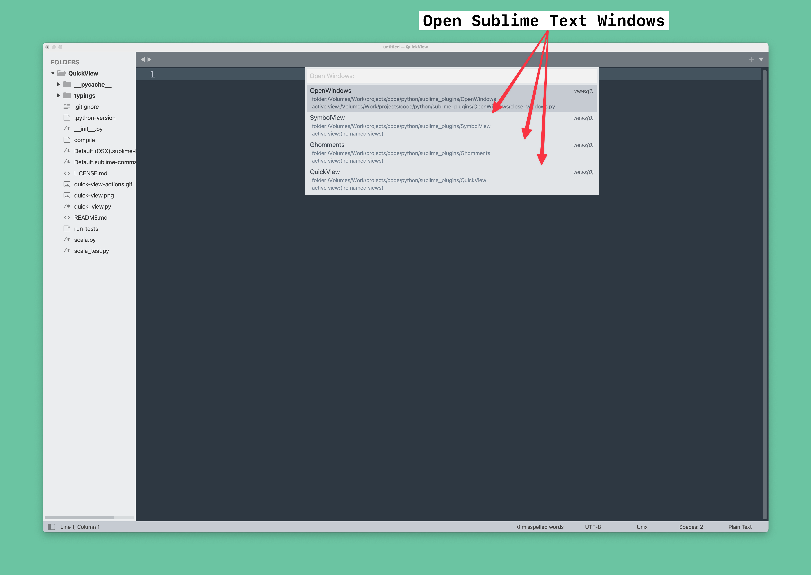
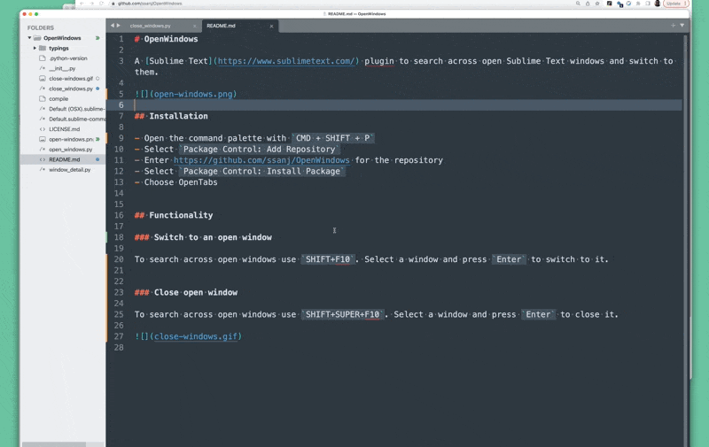
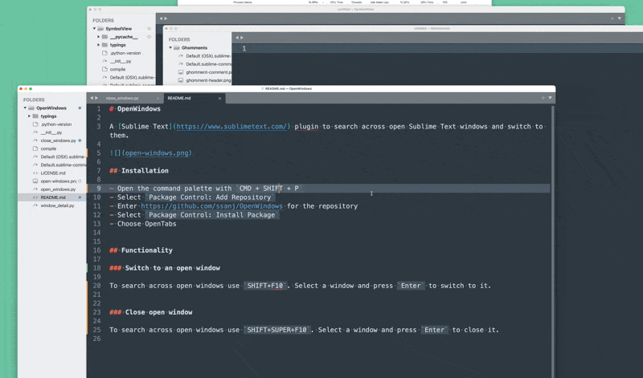

# OpenWindows

A [Sublime Text](https://www.sublimetext.com/) plugin to search across open Sublime Text windows and switch to them.

## Installation

- Open the command palette with `CMD + SHIFT + P`
- Select `Package Control: Add Repository`
- Enter https://github.com/ssanj/OpenWindows for the repository
- Select `Package Control: Install Package`
- Choose OpenTabs

## Functionality

### Switch to an open window

To search across open windows use `SHIFT+F10`. Select a window and press `Enter` to switch to it.

### Close open window

To search across open windows use `SHIFT+SUPER+F10`. Select a window and press `Enter` to close it.

